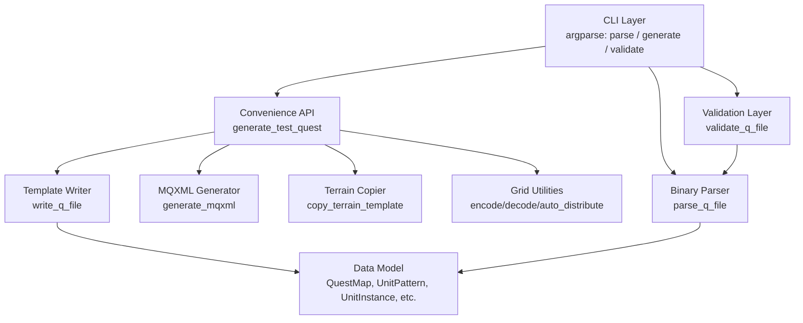
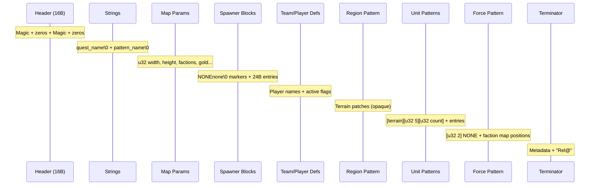
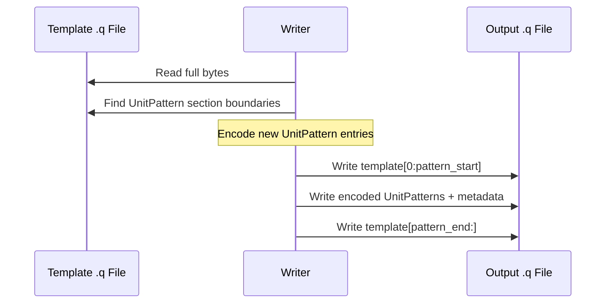

# Design Document: Quest Map Generator (Refactoring)

## Overview

The Quest Map Generator is a single-file Python tool (`QuestMapGenerator/quest_map_generator.py`) that parses, writes, and validates Majesty Gold HD `.q` binary quest template files. There is already a working implementation that successfully parses all 37 .q files and generates valid quest packages. This design covers a **terminology refactoring** to align the code with the correct RGS engine terminology discovered during reverse-engineering, plus addition of proper parsing for Team/Player definitions, Region Pattern, and Force Pattern sections.

The refactoring is intentionally conservative — the template-based writer approach is correct and stays. The data model names change, docstrings get corrected, and some parsing gaps get filled.

## Architecture



### Single-File Constraint

Everything lives in `QuestMapGenerator/quest_map_generator.py`. No external dependencies beyond Python stdlib. Tests in `QuestMapGenerator/test_all_quests.py`.

## Refactoring: What Changes vs What Stays

### Terminology Renames (Code-Level)

| Current Name | Correct Name | Reason |
|---|---|---|
| `PlacedEntry` | `UnitInstance` | An entry is a single unit/building/lair placed within a Unit Pattern |
| `PlacedGroup` | `UnitPattern` | A group is a Unit Pattern with a 5×5 grid and resolution |
| `positions` field | `candidate_cells` field | Multi-position means candidate random selection, not multiple placements |
| `Faction` (in Force Pattern) | `ForceEntry` | Force Pattern entries describe faction map positions |
| `factions` field on QuestMap | `force_pattern` field | This is the Force Pattern section |

### What Stays the Same

- Template-based writer approach (splice UnitPattern groups into a known-good .q)
- Grid position encoding/decoding (A-Y, 65-89)
- Auto-distribution algorithm
- MQXML generation
- CLI subcommands (parse, validate, generate)
- Convenience API signature (generate_test_quest)
- Test file structure

### New Parsing Additions

| Section | Current State | Target State |
|---|---|---|
| Team/Player definitions | Skipped during parse | Parse into `TeamDefinition` list on QuestMap |
| Region Pattern | Skipped (treated as opaque) | Parse terrain code + patch count (metadata only) |
| Force Pattern | Partially parsed | Fully parsed with `ForceEntry` objects |

## Data Model (Updated Terminology)

```python
from dataclasses import dataclass, field
from typing import Optional

class QFormatError(Exception):
    """Raised when a .q file has invalid format or structure."""
    pass


@dataclass
class MapParams:
    """Map generation parameters from the .q header area."""
    width: int = 256          # Map tile width
    height: int = 256         # Map tile height
    num_factions: int = 4     # Number of player/AI factions
    starting_gold: int = 2000
    secondary_resource: int = 10000


@dataclass
class SpawnerEntry:
    """A single monster type within a SpawnerBlock (24 bytes in binary)."""
    object_id: str            # 4-char ID (e.g., "BVr1" = Ratman Champion)
    spawn_level: int          # Spawn count/level value


@dataclass
class SpawnerBlock:
    """Defines which monsters a lair can spawn. Separated by NONEnone markers."""
    entries: list[SpawnerEntry] = field(default_factory=list)
    lair_resource: int = 0    # Resource value for this lair


@dataclass
class UnitInstance:
    """A single building/monster/landmark entry within a UnitPattern.
    
    Each UnitInstance is placed exactly once on the map. When candidate_cells
    contains multiple positions, the RGS randomly selects ONE cell for placement.
    This provides positional variety across map generations.
    """
    object_id: str            # 4-char ID (e.g., "ABJ1" = Palace, "BBz1" = Goblin Fortress)
    description: str          # Human-readable name (e.g., "Royal Palace")
    candidate_cells: list[int] = field(default_factory=list)
    # Grid position bytes (ASCII 'A'-'Y', 65-89).
    # Multiple entries = RGS picks one randomly. NOT multiple placements.

    @staticmethod
    def grid_col(pos_byte: int) -> int:
        """Column from position byte: (byte - 65) % 5"""
        return (pos_byte - 65) % 5

    @staticmethod
    def grid_row(pos_byte: int) -> int:
        """Row from position byte: (byte - 65) // 5"""
        return (pos_byte - 65) // 5


@dataclass
class UnitPattern:
    """A mid-level placement structure: a 5×5 Layout Grid with resolution.
    
    Contains one or more UnitInstance entries. The entire pattern is placed
    as a cluster on the map, with positions relative to the grid. The grid
    is randomly rotated (0/90/180/270) at generation time.
    """
    terrain_code: str = "gras"    # 4-char terrain type for this pattern
    resolution: int = 5           # Tile spacing between grid cells (from [u32 5] marker)
    entries: list[UnitInstance] = field(default_factory=list)
    faction_name: str = ""        # Owner faction (from metadata block after entries)


@dataclass
class TeamDefinition:
    """A team/player slot definition from the Team section.
    
    Defines the available factions for the quest (Human Player, AI players, Monsters).
    """
    name: str                     # e.g., "Human Player", "player2_ai", "Monsters"
    active: bool = True           # Whether this team slot is in use
    team_id: int = 0              # Team identifier byte


@dataclass
class RegionPatternInfo:
    """Metadata about the Region Pattern section (terrain generation).
    
    The actual terrain data is preserved opaquely by the template writer.
    We only parse enough to know what's there for display/validation.
    """
    pattern_name: str = ""        # e.g., "pattpattpattern"
    patch_count: int = 0          # Number of Region Patches defined
    terrain_codes: list[str] = field(default_factory=list)  # e.g., ["gras", "snow"]


@dataclass
class ForceEntry:
    """A faction's position within the Force Pattern (top-level map layout).
    
    The Force Pattern determines WHERE on the overall map each faction's
    UnitPattern cluster is placed. Uses its own 5×5 grid.
    """
    short_code: str               # 4-char code (e.g., "Play", "Gobl", "Mons")
    full_name: str                # Full name (e.g., "Player1", "Goblin Kingdom")
    active: bool = True           # Whether this faction is active in the quest
    map_position: int = 77        # Grid position byte on the Force Pattern grid (A-Y)


@dataclass
class QuestMap:
    """Complete parsed representation of a .q quest template file."""
    magic: str = "RGMa"           # File format: "RGMa", "RGM6", or "RGM9"
    quest_name: str = ""          # Quest identifier string
    pattern_name: bytes = b""     # 12-byte pattern name (references GPL entry)
    params: MapParams = field(default_factory=MapParams)
    spawner_blocks: list[SpawnerBlock] = field(default_factory=list)
    teams: list[TeamDefinition] = field(default_factory=list)
    region_info: Optional[RegionPatternInfo] = None
    unit_patterns: list[UnitPattern] = field(default_factory=list)  # Was: placed_groups
    force_pattern: list[ForceEntry] = field(default_factory=list)   # Was: factions
```

## Q File Binary Format Specification

### File Structure Hierarchy



### Format Versions

| Magic | Source | Notes |
|-------|--------|-------|
| `RGMa` | RGSEditor / custom quests | Target output format |
| `RGM6` | Base game quests | Read-only support |
| `RGM9` | Expansion quests | Read-only support |

### UnitInstance Binary Encoding

```
[4B Object_ID] [u32 0] [null-terminated description\0] [u32 candidate_count] [candidate_count × u8 position_byte]
```

- `Object_ID`: 4 ASCII characters (e.g., "ABJ1", "BBw1")
- `u32 0`: Reserved/padding (always zero)
- `description`: C-string, null-terminated
- `candidate_count`: Number of candidate cells (1 = deterministic, >1 = random selection)
- `position_bytes`: Each byte in range 65-89 (ASCII 'A'-'Y'), one per candidate cell

### UnitPattern Binary Encoding

```
[4B terrain_code] [u32 resolution(5)] [u32 entry_count]
  entry_count × UnitInstance
[metadata block: u32×10 values]
[null-terminated faction_name\0]
```

### Force Pattern Binary Encoding (end of file)

```
[u32 2] "NONE"
[u32 unit_pattern_count] [u32 total_force_entries]
  ForceEntry×N:
    [4B short_code] [u32 5] [null-terminated full_name\0] [u32 active_flag] [u8 map_position]
[final metadata]
"Rel@"
```

### Position Grid Encoding

```
     col 0   col 1   col 2   col 3   col 4
row 0:  A(65)   B(66)   C(67)   D(68)   E(69)
row 1:  F(70)   G(71)   H(72)   I(73)   J(74)
row 2:  K(75)   L(76)   M(77)   N(78)   O(79)
row 3:  P(80)   Q(81)   R(82)   S(83)   T(84)
row 4:  U(85)   V(86)   W(87)   X(88)   Y(89)
```

- Encode: `byte = 65 + row * 5 + col`
- Decode: `col = (byte - 65) % 5`, `row = (byte - 65) // 5`
- Center: M (77) at (2, 2) — Palace position
- Multiple candidate_cells per UnitInstance = RGS picks one randomly (NOT multiple placements)

## Components and Interfaces

### Grid Utilities

```python
CENTER = ord('M')  # 77

def grid_to_byte(col: int, row: int) -> int:
    """Encode (col, row) to position byte. Raises ValueError if out of 0-4 range."""

def byte_to_grid(byte_val: int) -> tuple[int, int]:
    """Decode position byte to (col, row). Raises ValueError if not 65-89."""

def letter_to_byte(letter: str) -> int:
    """Convert grid letter 'A'-'Y' to byte. Raises ValueError if invalid."""

def byte_to_letter(byte_val: int) -> str:
    """Convert byte 65-89 to grid letter 'A'-'Y'. Raises ValueError if invalid."""

def auto_distribute(n: int, exclude: Optional[list[int]] = None) -> list[int]:
    """Assign N grid positions avoiding excluded cells (center by default).
    Priority: corners → edge midpoints → inner ring → remaining.
    Raises ValueError if n > available cells."""

def validate_placements(entries: list[UnitInstance]) -> None:
    """Check no two building-type entries (AB*, BB*) share same grid cell.
    Raises ValueError identifying conflicting entries."""
```

### Parser

```python
def parse_q_file(filepath) -> QuestMap:
    """Parse a .q binary file into a QuestMap structure.
    
    Supports RGMa, RGM6, RGM9 formats. Raises QFormatError on invalid magic.
    Extracts: header, spawner blocks, teams, region info, unit patterns, force pattern.
    """
```

### Template Writer

```python
def write_q_file(
    unit_patterns: list[UnitPattern],
    output_path,
    template: Optional[str] = None,
    spawner_blocks: Optional[list[SpawnerBlock]] = None,
) -> None:
    """Write a .q file by splicing custom UnitPatterns into a template.
    
    Preserves the template's header, spawners (unless overridden), teams,
    region pattern, and force pattern. Only the UnitPattern section is replaced.
    """

def write_q_file_simple(
    entries: list[UnitInstance],
    output_path,
    template: Optional[str] = None,
) -> None:
    """Simplified writer: wraps entries in a single UnitPattern and writes."""
```

### Convenience API

```python
def generate_test_quest(
    quest_name: str,
    lairs: list[dict],         # [{"id": "BBw1", "desc": "Ice Cave", "position": "N"}]
    output_dir: str,
    palace_position: str = "M",
    starting_gold: int = 50000,
    extra_loads: list[str] = None,
    template: Optional[str] = None,
) -> None:
    """Generate complete quest package (.q + .rgs + .mqxml) for mod testing."""
```

### MQXML Generator

```python
def generate_mqxml(
    quest_name: str,
    output_path: str,
    dataset_base: str = "Majesty",
    rgs_filename: Optional[str] = None,
    extra_loads: list[str] = None,
) -> None:
    """Generate .mqxml quest definition XML referencing the .q and .rgs files."""
```

### Formatter and Validator

```python
def format_q_text(qmap: QuestMap) -> str:
    """Produce human-readable text representation of a parsed QuestMap."""

def validate_q_file(filepath) -> list[ValidationIssue]:
    """Validate structural integrity of a .q file. Returns list of issues."""

def compare_q_files(generated_path, reference_path) -> list[str]:
    """Compare structural properties between two .q files."""
```

## Template Writer Design

The writer works by:

1. Read the template .q file (default: `MyQuest/Quest.q`)
2. Locate the UnitPattern section boundaries (start of first `[terrain][u32 5][u32 count]` header through end of last metadata block)
3. Splice: `template_before_patterns + encoded_new_patterns + template_after_patterns`
4. Write the result to output path

This preserves the template's header, spawner definitions, team/player definitions, region pattern, and force pattern — which are all complex to generate from scratch and rarely need customization for test quests.



## Error Handling

| Condition | Exception | Message Content |
|---|---|---|
| Invalid magic bytes | `QFormatError` | File path + expected vs actual magic |
| Position byte out of range | `ValueError` | The invalid byte + valid range 65-89 |
| Grid coord out of range | `ValueError` | Invalid coord + valid range 0-4 |
| Grid letter out of range | `ValueError` | Invalid letter + valid range A-Y |
| Two buildings share cell | `ValueError` | Both object IDs + shared cell letter |
| Too many items for grid | `ValueError` | Count + available positions |
| Missing template file | `FileNotFoundError` | Searched path |
| Object ID not 4 chars | `ValueError` | The invalid ID |

## Testing Strategy

### Unit Testing

- Grid encoding/decoding: all 25 positions round-trip
- Auto-distribution: correct count, excludes center, no duplicates
- Validation: catches conflicts, allows non-building sharing

### Integration Testing

- Parse all 37 .q files without errors (existing test)
- Generate → parse → verify structural equivalence

### Property-Based Testing

**Property Test Library**: hypothesis (Python)

Round-trip property is the critical correctness check since the game provides no error messages on load failure.

## Performance Considerations

Not applicable — all .q files are under 112KB, parsing is near-instant. No optimization needed.

## Security Considerations

Not applicable — offline tool processing local binary files for game modding.

## Dependencies

- Python 3.10+ (dataclasses, struct, pathlib, argparse, uuid, shutil)
- No external packages
- Test dependency: hypothesis (for property-based tests only, optional)

## Correctness Properties

*A property is a characteristic or behavior that should hold true across all valid executions of a system — essentially, a formal statement about what the system should do. Properties serve as the bridge between human-readable specifications and machine-verifiable correctness guarantees.*

### Property 1: Grid encoding round-trip

For any valid grid coordinate pair (col, row) where 0 ≤ col ≤ 4 and 0 ≤ row ≤ 4, encoding to a position byte and decoding back shall produce the original (col, row).

**Validates: Requirements 3.1, 3.2, 3.3**

### Property 2: UnitPattern write-parse round-trip

For any valid list of UnitInstance entries (with 4-char object IDs, non-empty descriptions, and candidate_cells bytes in 65-89), writing them to a .q file via the template writer and parsing the result shall produce a QuestMap containing equivalent UnitInstance data.

**Validates: Requirements 2.1, 2.7**

### Property 3: Auto-distribution produces valid non-overlapping positions

For any count N where 1 ≤ N ≤ 24, auto_distribute(N) shall return exactly N unique position bytes, all in range 65-89, none equal to CENTER (77), and with no duplicates.

**Validates: Requirements 4.1, 4.2, 4.5**

### Property 4: Position byte encoding bijectivity

For any byte value in the range 65-89, decoding to (col, row) and re-encoding shall produce the original byte. Conversely, for any letter 'A'-'Y', converting to byte and back to letter shall produce the original letter.

**Validates: Requirements 3.1, 3.2, 3.3**

### Property 5: Validation detects all building conflicts

For any list of UnitInstance entries where two building-type entries (object_id starting with "AB" or "BB") share at least one candidate_cell, validate_placements shall raise a ValueError.

**Validates: Requirements 5.1, 5.2**

### Property 6: Parse produces valid position bytes

For any successfully parsed .q file, every candidate_cell byte in every UnitInstance within every UnitPattern shall be in the range 65-89.

**Validates: Requirements 1.5, 10.3**
